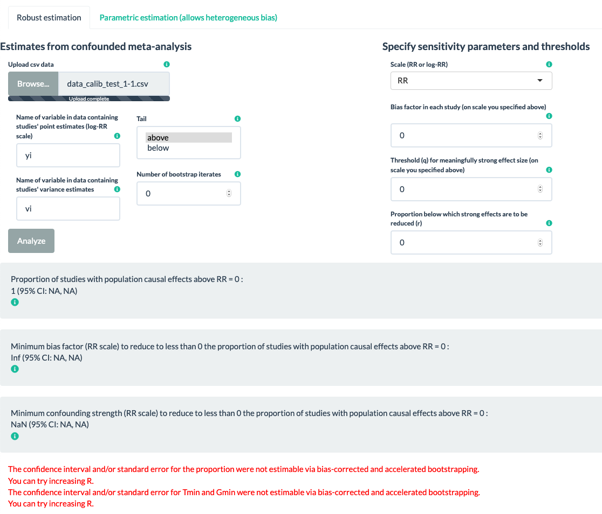

This is an [R Markdown](http://rmarkdown.rstudio.com) Notebook. When you execute code within the notebook, the results appear beneath the code. 

Try executing this chunk by clicking the *Run* button within the chunk or by placing your cursor inside it and pressing *Cmd+Shift+Enter*. 

```{r warning=FALSE, message=FALSE, results=FALSE}
# install.packages("testthat")
# install.packages("devtools")
# install.packages("dplyr")
# install.packages("ICC")
# install.packages("MetaUtility")
# install.packages("ggplot2")
library(testthat)
#library(EValue)
library(devtools)
library(dplyr)
library(ICC)
library(MetaUtility)
library(ggplot2)
```

### Below tests run on 11/10/20 with github code pull on 11/09/20 at 2:45pm:
```{r}
source("~/Box Sync/jlee/Maya/evalue/EValue/tests/helper_testthat.R")
source("~/Box Sync/jlee/Maya/evalue/EValue/R/meta-analysis.R")

setwd("~/Box Sync/jlee/Maya/evalue/tests_human_inspection/")
```

#### test1 gbc_prepped.csv file
```{r  error=TRUE}
d = read.csv("Datasets for website test/gbc_prepped.csv")

confounded_meta(q = log(.9),
                r = 0.1,
                muB = 0,
                tail = "below",
                yi.name = "yi",
                vi.name = "vi",
                dat = d,
                R = 500)
### R output:
# The confidence interval and/or standard error for the proportion were not estimable via bias-corrected and accelerated bootstrapping. You can try increasing R.
# The confidence interval and/or standard error for Tmin and Gmin were not estimable via bias-corrected and accelerated bootstrapping. You can try increasing R.
#   Value        Est SE CI.lo CI.hi
# 1  Prop 0.02358491 NA    NA    NA
# 2  Tmin 1.00000000 NA    NA    NA
# 3  Gmin 1.00000000 NA    NA    NA
# Warning message:
# In confounded_meta(q = log(0.9), r = 0.1, muB = 0, tail = "below",  :
#   Phat is already less than or equal to r even with no confounding, so Tmin and Gmin are simply equal to 1. No confounding at all is required to make the specified shift.

### Website output: 
knitr::include_graphics("jl_website_test1a.png")


sens_plot(type = "line",
          q = log(0.9),
          tail = "below",
          Bmin = log(1),
          Bmax = log(4),
          yi.name = "yi",
          vi.name = "vi",
          dat = d,
          R = 500)

### R output:
# Warning message:
# In sens_plot(type = "line", q = log(0.9), tail = "below", Bmin = log(1),  :
#   None of the pointwise confidence intervals were not estimable via bias-corrected and accelerated bootstrapping, so the confidence band on the plot is omitted. You can try increasing R.

### Website output: 
knitr::include_graphics("jl_website_test1b.png")
```

#### test2 gbc_prepped.csv file
```{r  error=TRUE}
d = read.csv("Datasets for website test/gbc_prepped.csv")

confounded_meta(q = log(.5),
                r = 0.5,
                muB = 0.5,
                tail = "above",
                yi.name = "yi",
                vi.name = "vi",
                dat = d,
                R = 2000)
### R output:
# The confidence interval and/or standard error for the proportion were not estimable via bias-corrected and accelerated bootstrapping. You can try increasing R.
# The confidence interval and/or standard error for Tmin and Gmin were not estimable via bias-corrected and accelerated bootstrapping. You can try increasing R.
#   Value      Est SE CI.lo CI.hi
# 1  Prop 1.000000 NA    NA    NA
# 2  Tmin 2.133700 NA    NA    NA
# 3  Gmin 3.689005 NA    NA    NA

### Website output: 
knitr::include_graphics("jl_website_test2a.png")

sens_plot(type = "line",
          q = log(.5),
          tail = "above",
          Bmin = log(1),
          Bmax = log(6),
          yi.name = "yi",
          vi.name = "vi",
          dat = d,
          R = 2000)

### R output:
# Warning message:
# In sens_plot(type = "line", q = log(0.5), tail = "above", Bmin = log(1),  :
#   None of the pointwise confidence intervals were not estimable via bias-corrected and accelerated bootstrapping, so the confidence band on the plot is omitted. You can try increasing R.

### Website output: 
knitr::include_graphics("jl_website_test2b.png")
```

#### test3 gbc_prepped.csv file
```{r error=TRUE}
d = read.csv("Datasets for website test/gbc_prepped.csv")

## get error for column name
confounded_meta(q = log(.5),
                r = 0.5,
                muB = 0.5,
                tail = "above",
                yi.name = "yi",
                vi.name = "vyi",
                dat = d,
                R = 2000)
### R output:
 # Error in Phat_causal(q = q, B = muB, tail = tail, dat = dat, yi.name = yi.name,  : 
 #  dat does not contain a column named vi.name 

### Website output: 
knitr::include_graphics("jl_website_test3.png")
```

#### test4 flegal_prepped.csv file
```{r error=TRUE}
d = read.csv("Datasets for website test/flegal_prepped.csv")

## on log-RR scale:
log(.5)
confounded_meta(q = -0.6931472,
                r = 0.5,
                muB = 0.5,
                tail = "above",
                yi.name = "yi",
                vi.name = "vi",
                dat = d,
                R = 500)
### R output:
# The confidence interval and/or standard error for the proportion were not estimable via bias-corrected and accelerated bootstrapping. You can try increasing R.
# The confidence interval and/or standard error for Tmin and Gmin were not estimable via bias-corrected and accelerated bootstrapping. You can try increasing R.
#   Value       Est SE CI.lo CI.hi
# 1  Prop 0.8285714 NA    NA    NA
# 2  Tmin 1.8341568 NA    NA    NA
# 3  Gmin 3.0710781 NA    NA    NA

### Website output: 
knitr::include_graphics("jl_website_test4a.png")

sens_plot(type = "line",
          q = -0.6931472,
          tail = "above",
          Bmin = 1,
          Bmax = 4,
          yi.name = "yi",
          vi.name = "vi",
          dat = d,
          R = 500)

### R output:
# Warning message:
# In sens_plot(type = "line", q = log(0.5), tail = "above", Bmin = log(1),  :
#   None of the pointwise confidence intervals were not estimable via bias-corrected and accelerated bootstrapping, so the confidence band on the plot is omitted. You can try increasing R.

### Website output: 
knitr::include_graphics("jl_website_test4b.png")
```

#### test5 flegal_prepped.csv file
```{r error=TRUE}
d = read.csv("Datasets for website test/flegal_prepped.csv")

## extreme R?
confounded_meta(q = log(.5),
                r = 0.1,
                muB = .5,
                tail = "above",
                yi.name = "yi",
                vi.name = "vi",
                dat = d,
                R = 100000)
### R output:
# The confidence interval and/or standard error for the proportion were not estimable via bias-corrected and accelerated bootstrapping. You can try increasing R.
# The confidence interval and/or standard error for Tmin and Gmin were not estimable via bias-corrected and accelerated bootstrapping. You can try increasing R.
#   Value       Est SE CI.lo CI.hi
# 1  Prop 0.8285714 NA    NA    NA
# 2  Tmin 2.1777251 NA    NA    NA
# 3  Gmin 3.7792124 NA    NA    NA

### Website output: 
knitr::include_graphics("jl_website_test5.png")
```

#### test6 flegal_prepped.csv file
```{r error=TRUE}
d = read.csv("Datasets for website test/flegal_prepped.csv")

confounded_meta(q = log(1.2),
                r = 1.0,
                muB = 0,
                tail = "above",
                yi.name = "yi",
                vi.name = "vi",
                dat = d,
                R = 500)
### R output:
# The confidence interval and/or standard error for the proportion were not estimable via bias-corrected and accelerated bootstrapping. You can try increasing R.
# The confidence interval and/or standard error for Tmin and Gmin were not estimable via bias-corrected and accelerated bootstrapping. You can try increasing R.
#   Value        Est SE CI.lo CI.hi
# 1  Prop 0.03571429 NA    NA    NA
# 2  Tmin 1.00000000 NA    NA    NA
# 3  Gmin 1.00000000 NA    NA    NA
# Warning message:
# In confounded_meta(q = log(1.2), r = 1, muB = 0, tail = "above",  :
#   Phat is already less than or equal to r even with no confounding, so Tmin and Gmin are simply equal to 1. No confounding at all is required to make the specified shift.

### Website output: 
knitr::include_graphics("jl_website_test6.png")
```

#### test7 data_calib_test_1-1.csv file
```{r error=TRUE}
d = read.csv("Datasets for website test/data_calib_test_1-1.csv")

## all 0
confounded_meta(q = log(0),
                r = 0,
                muB = 0,
                tail = "above",
                yi.name = "yi",
                vi.name = "vi",
                dat = d,
                R = 0)
### R output:
# The confidence interval and/or standard error for the proportion were not estimable via bias-corrected and accelerated bootstrapping. You can try increasing R.
# The confidence interval and/or standard error for Tmin and Gmin were not estimable via bias-corrected and accelerated bootstrapping. You can try increasing R.
#   Value Est SE CI.lo CI.hi
# 1  Prop   1 NA    NA    NA
# 2  Tmin Inf NA    NA    NA
# 3  Gmin NaN NA    NA    NA

### Website output: 

```

#### test8 data_calib_test_1-1.csv file
```{r error=TRUE}
d = read.csv("Datasets for website test/data_calib_test_1-1.csv")

## parametric method test
## vt2 = prop*t2^2
confounded_meta(method="parametric",
                q=log(1.1),
                r=0.2,
                tail="above",
                muB=log(1.2),
                sigB=0,
                yr=log(1.2),
                vyr=0.01^2,
                t2=0.1,
                vt2=0.35*(0.1^2))
### R output:
#   Value       Est         SE     CI.lo     CI.hi
# 1  Prop 0.3815558 0.03606286 0.3108739 0.4522377
# 2  Tmin 1.4235523 0.11297173 1.2021318 1.6449728
# 3  Gmin 2.2000501 0.24733823 1.7152761 2.6848242

### Website output: 
knitr::include_graphics("jl_website_test8a.png")

sens_plot(method = "parametric",
          type="line",
          q=log(1.1),
          yr=log(1.2),
          vyr=0.01^2,
          t2=0.1,
          vt2=0.35*(0.1^2),
          Bmin=log(1),
          Bmax=log(4),
          sigB=0,
          tail="above" )

### R output:
# Warning message:
# In sens_plot(method = "parametric", type = "line", q = log(1.1),  :
#   Calculating parametric confidence intervals in the plot. For values of Phat that are less than 0.15 or greater than 0.85, these confidence intervals may not perform well.

### Website output: 
knitr::include_graphics("jl_website_test8b.png")
```


Add a new chunk by clicking the *Insert Chunk* button on the toolbar or by pressing *Cmd+Option+I*.

When you save the notebook, an HTML file containing the code and output will be saved alongside it (click the *Preview* button or press *Cmd+Shift+K* to preview the HTML file). 

The preview shows you a rendered HTML copy of the contents of the editor. Consequently, unlike *Knit*, *Preview* does not run any R code chunks. Instead, the output of the chunk when it was last run in the editor is displayed.

