This is an [R Markdown](http://rmarkdown.rstudio.com) Notebook. When you execute code within the notebook, the results appear beneath the code. 

Try executing this chunk by clicking the *Run* button within the chunk or by placing your cursor inside it and pressing *Cmd+Shift+Enter*. 

```{r warning=FALSE, message=FALSE, results=FALSE}
# install.packages("testthat")
# install.packages("devtools")
# install.packages("dplyr")
# install.packages("ICC")
# install.packages("MetaUtility")
# install.packages("ggplot2")
library(testthat)
#library(EValue)
library(devtools)
library(dplyr)
library(ICC)
library(MetaUtility)
library(ggplot2)
library(boot)
```

### Below tests run on 11/10/20 with github code pull on 11/09/20 at 2:45pm:
```{r}
source("~/Box Sync/jlee/Maya/evalue/EValue/tests/helper_testthat.R")
source("~/Box Sync/jlee/Maya/evalue/EValue/R/meta-analysis.R")

setwd("~/Box Sync/jlee/Maya/evalue/tests_human_inspection/")
```

#### test1 gbc_prepped.csv file
```{r  error=TRUE}
d = read.csv("Datasets for website test/gbc_prepped.csv")

confounded_meta(q = log(.9),
                r = 0.1,
                muB = 0,
                tail = "below",
                yi.name = "yi",
                vi.name = "vi",
                dat = d,
                R = 500)
### R output:
# [1] "All values of t are equal to  1 \n Cannot calculate confidence intervals"
#  Show Traceback
#  
#  Rerun with Debug
#  Error in data.frame(lo.T, hi.T, SE.T, lo.G, hi.G, SE.G) : 
#   arguments imply differing number of rows: 1, 0 

### Website output: 
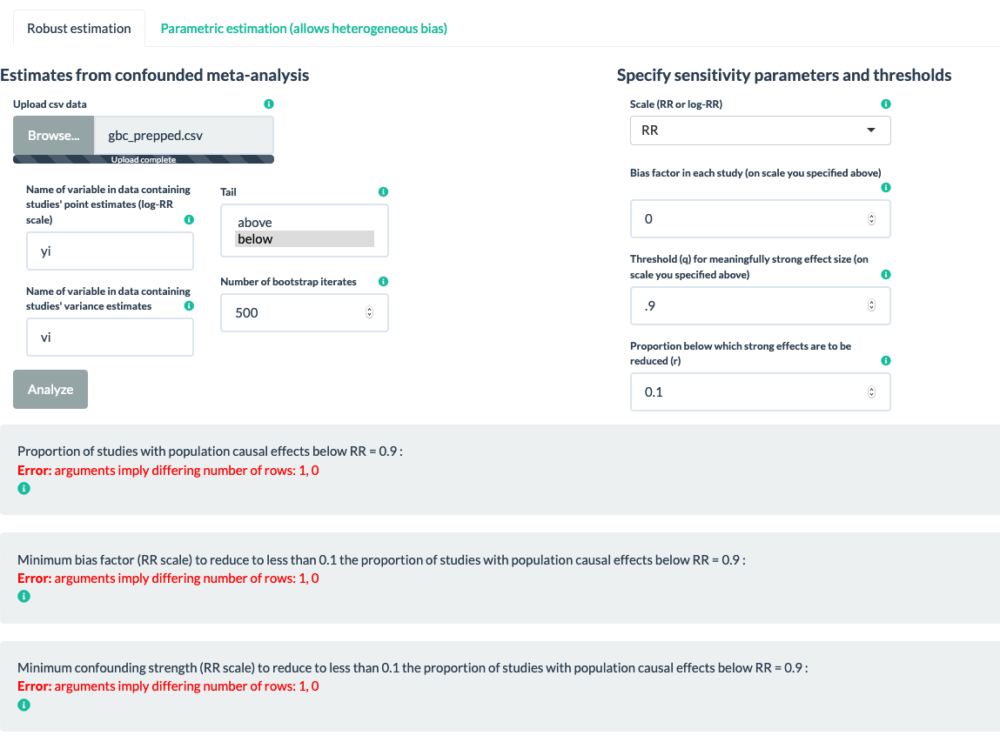


sens_plot(type = "line",
          q = log(0.9),
          tail = "below",
          Bmin = log(1),
          Bmax = log(4),
          yi.name = "yi",
          vi.name = "vi",
          dat = d,
          R = 500)

### R output:
# Warning message:
# In sens_plot(type = "line", q = log(0.9), tail = "below", Bmin = log(1),  :
#   Some of the pointwise confidence intervals were not estimable via bias-corrected and accelerated bootstrapping, so the confidence band on the plot may not be shown for some values of the bias factor. You can try increasing R.

### Website output: 
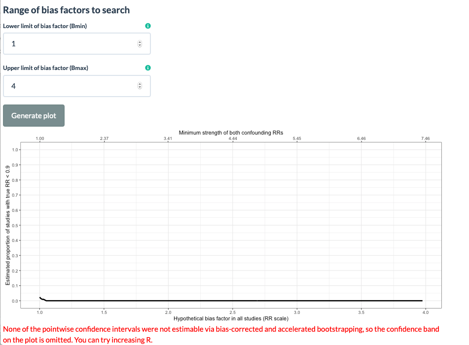
```

#### test2 gbc_prepped.csv file
```{r  error=TRUE}
d = read.csv("Datasets for website test/gbc_prepped.csv")

confounded_meta(q = log(.5),
                r = 0.5,
                muB = 0.5,
                tail = "above",
                yi.name = "yi",
                vi.name = "vi",
                dat = d,
                R = 500)
### R output:
#   Value      Est          SE     CI.lo    CI.hi
# 1  Prop 1.000000 0.001951293 0.9858491 1.000000
# 2  Tmin 2.133700 0.025066232 2.0871944 2.183581
# 3  Gmin 3.689005 0.051400052 3.5935762 3.791202
# Warning message:
# In norm.inter(t, adj.alpha) : extreme order statistics used as endpoints


### Website output: 
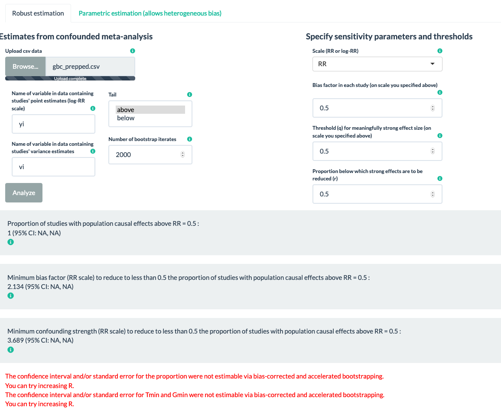

sens_plot(type = "line",
          q = log(.5),
          tail = "above",
          Bmin = log(1),
          Bmax = log(6),
          yi.name = "yi",
          vi.name = "vi",
          dat = d,
          R = 500)

### R output:
# Warning message:
# In sens_plot(type = "line", q = log(0.5), tail = "above", Bmin = log(1),  :
#   None of the pointwise confidence intervals were not estimable via bias-corrected and accelerated bootstrapping, so the confidence band on the plot is omitted. You can try increasing R.

### Website output: 
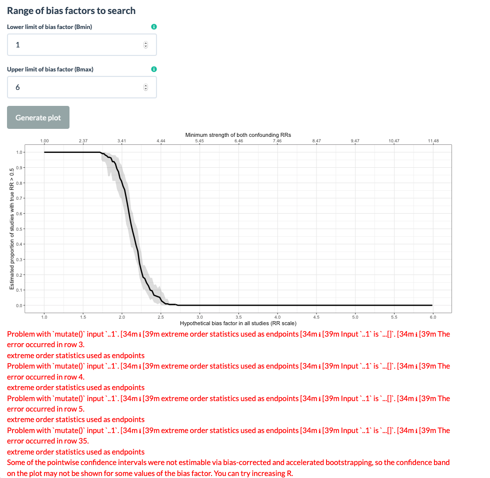
```

#### test3 gbc_prepped.csv file
```{r error=TRUE}
d = read.csv("Datasets for website test/gbc_prepped.csv")

## get error for column name
confounded_meta(q = log(.5),
                r = 0.5,
                muB = 0.5,
                tail = "above",
                yi.name = "yi",
                vi.name = "vyi",
                dat = d,
                R = 2000)
### R output:
 # Error in Phat_causal(q = q, B = muB, tail = tail, dat = dat, yi.name = yi.name,  : 
 #  dat does not contain a column named vi.name 

### Website output: 
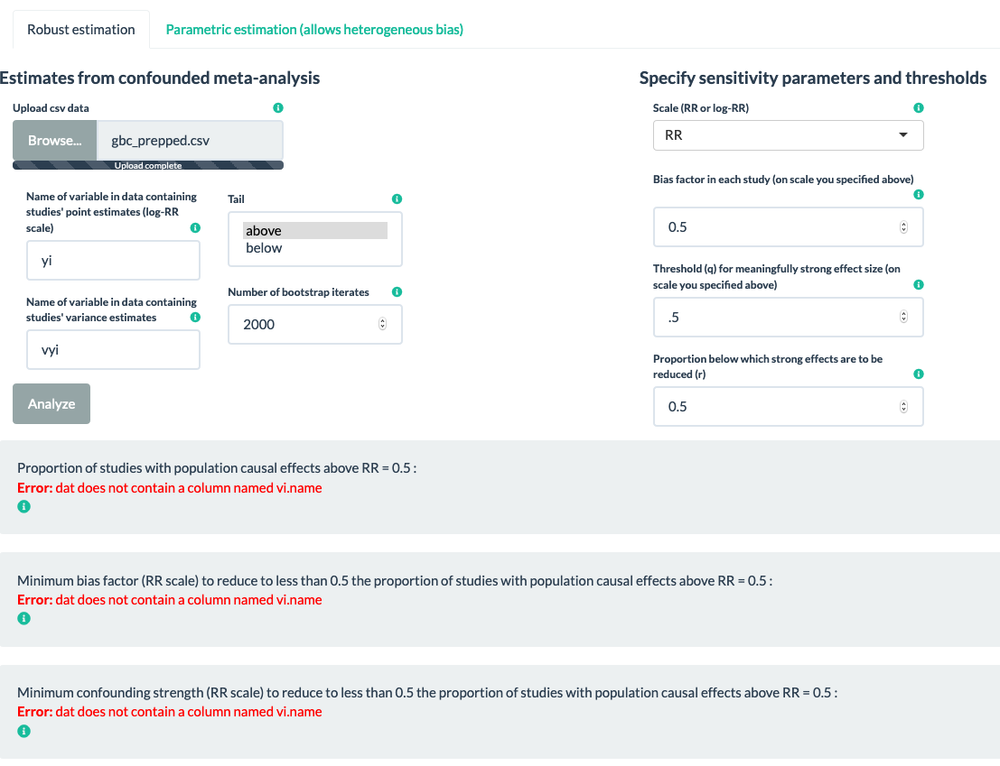
```

#### test4 flegal_prepped.csv file
```{r error=TRUE}
d = read.csv("Datasets for website test/flegal_prepped.csv")

## on log-RR scale:
# log(.5)
confounded_meta(q = -0.6931472,
                r = 0.5,
                muB = 0.5,
                tail = "above",
                yi.name = "yi",
                vi.name = "vi",
                dat = d,
                R = 500)
### R output:
#   Value       Est         SE     CI.lo     CI.hi
# 1  Prop 0.8285714 0.03891938 0.7385156 0.8928571
# 2  Tmin 1.8341568 0.02953164 1.7897376 1.9005732
# 3  Gmin 3.0710782 0.06134111 2.9786123 3.2088566

### Website output: 
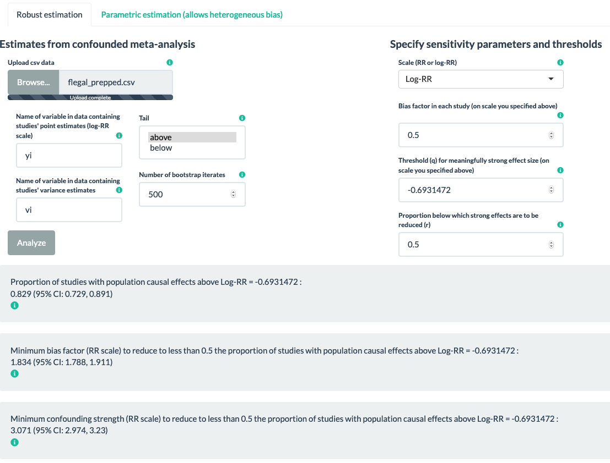

sens_plot(type = "line",
          q = -0.6931472,
          tail = "above",
          Bmin = 1,
          Bmax = 4,
          yi.name = "yi",
          vi.name = "vi",
          dat = d,
          R = 500)

### R output:
# Warning message:
# In sens_plot(type = "line", q = -0.6931472, tail = "above", Bmin = 1,  :
#   None of the pointwise confidence intervals were not estimable via bias-corrected and accelerated bootstrapping, so the confidence band on the plot is omitted. You can try increasing R.

### Website output: 
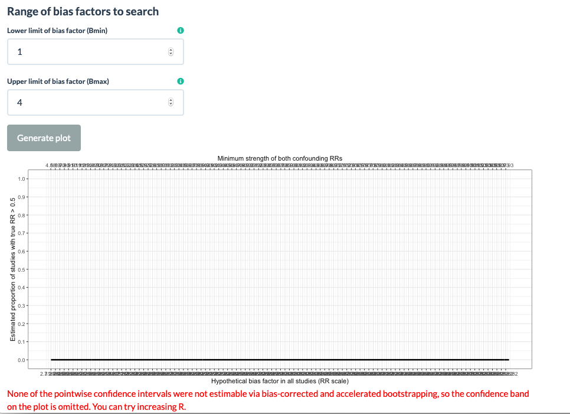
```

#### test5 flegal_prepped.csv file
```{r error=TRUE}
d = read.csv("Datasets for website test/flegal_prepped.csv")

## extreme R?
confounded_meta(q = log(.5),
                r = 0.1,
                muB = .5,
                tail = "above",
                yi.name = "yi",
                vi.name = "vi",
                dat = d,
                R = 10000)
### R output:
#   Value       Est         SE     CI.lo     CI.hi
# 1  Prop 0.8285714 0.03971533 0.7357143 0.8928571
# 2  Tmin 2.1777251 0.08610269 2.0699317 2.3537022
# 3  Gmin 3.7792124 0.17615242 3.5581137 4.1386985

### Website output: 
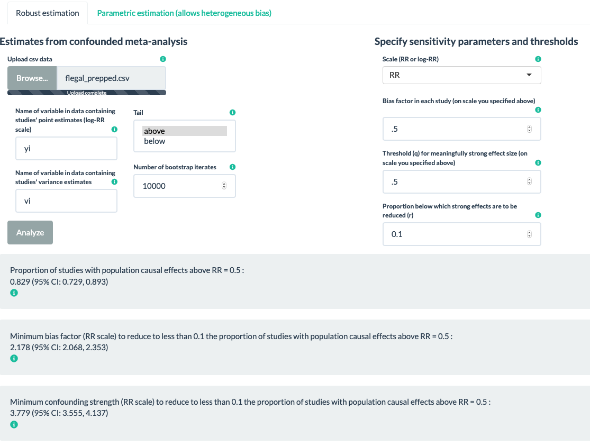
```

#### test6 flegal_prepped.csv file
```{r error=TRUE}
d = read.csv("Datasets for website test/flegal_prepped.csv")

confounded_meta(q = log(1.2),
                r = 1.0,
                muB = 0,
                tail = "above",
                yi.name = "yi",
                vi.name = "vi",
                dat = d,
                R = 500)
### R output:
# [1] "All values of t are equal to  1 \n Cannot calculate confidence intervals"
#  Show Traceback
#  
#  Rerun with Debug
#  Error in data.frame(lo.T, hi.T, SE.T, lo.G, hi.G, SE.G) : 
#   arguments imply differing number of rows: 1, 0 

### Website output: 
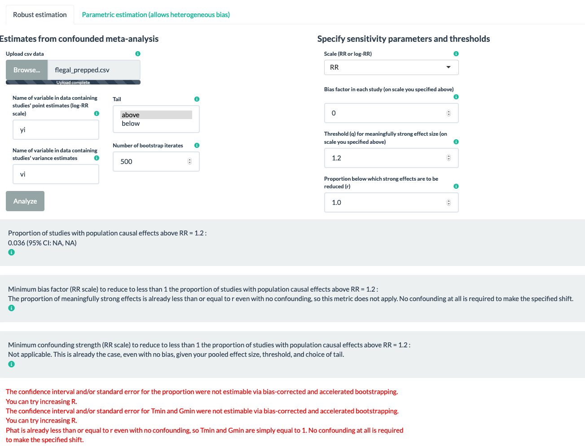
```

#### test7 data_calib_test_1-1.csv file
```{r error=TRUE}
d = read.csv("Datasets for website test/data_calib_test_1-1.csv")

## all 0
confounded_meta(q = log(0),
                r = 0,
                muB = 0,
                tail = "above",
                yi.name = "yi",
                vi.name = "vi",
                dat = d,
                R = 0)
### R output:
# [1] "All values of t are equal to  NaN \n Cannot calculate confidence intervals"
# The confidence interval and/or standard error for the proportion were not estimable via bias-corrected and accelerated bootstrapping. You can try increasing R.
# [1] "All values of t are equal to  NaN \n Cannot calculate confidence intervals"
# The confidence interval and/or standard error for Tmin and Gmin were not estimable via bias-corrected and accelerated bootstrapping. You can try increasing R.
#   Value Est SE CI.lo CI.hi
# 1  Prop   1 NA    NA    NA
# 2  Tmin Inf NA    NA    NA
# 3  Gmin NaN NA    NA    NA

### Website output: 


sens_plot(type = "line",
          q = log(0),
          tail = "above",
          Bmin = log(0),
          Bmax = log(0),
          yi.name = "yi",
          vi.name = "vi",
          dat = d,
          R = 0)

### R output:
 # Error in seq.default(Bmin, Bmax, 0.01) : 'from' must be a finite number 

### Website output: 

```

#### test8 data_calib_test_1-1.csv file
```{r error=TRUE}
d = read.csv("Datasets for website test/data_calib_test_1-1.csv")

## parametric method test
## vt2 = prop*t2^2
confounded_meta(method="parametric",
                q=log(1.1),
                r=0.2,
                tail="above",
                muB=log(1.2),
                sigB=0,
                yr=log(1.2),
                vyr=0.01^2,
                t2=0.1,
                vt2=0.35*(0.1^2))
### R output:
#   Value       Est         SE     CI.lo     CI.hi
# 1  Prop 0.3815558 0.03606286 0.3108739 0.4522377
# 2  Tmin 1.4235523 0.11297173 1.2021318 1.6449728
# 3  Gmin 2.2000501 0.24733823 1.7152761 2.6848242

### Website output: 
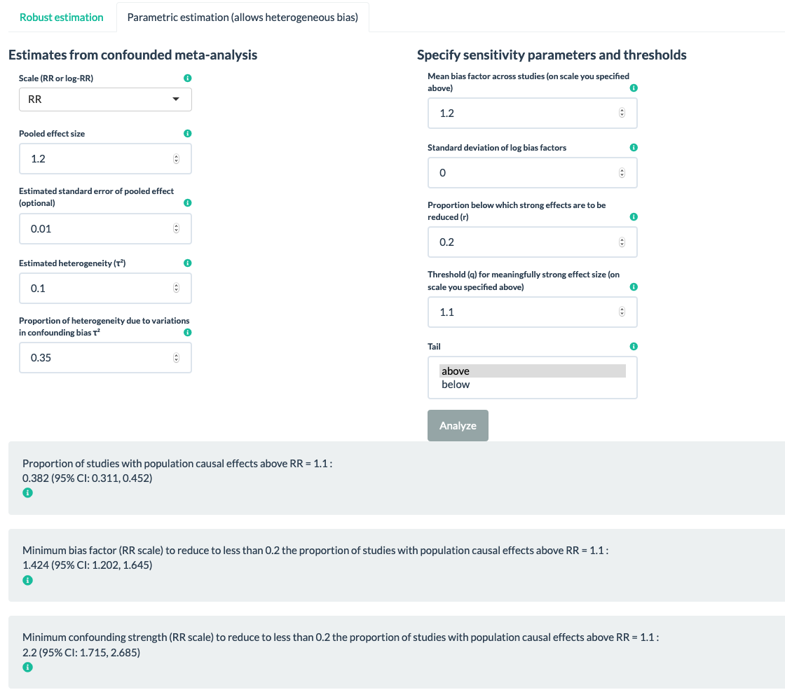

sens_plot(method = "parametric",
          type="line",
          q=log(1.1),
          yr=log(1.2),
          vyr=0.01^2,
          t2=0.1,
          vt2=0.35*(0.1^2),
          Bmin=log(1),
          Bmax=log(4),
          sigB=0,
          tail="above" )

### R output:
# Warning message:
# In sens_plot(method = "parametric", type = "line", q = log(1.1),  :
#   Calculating parametric confidence intervals in the plot. For values of Phat that are less than 0.15 or greater than 0.85, these confidence intervals may not perform well.

### Website output: 
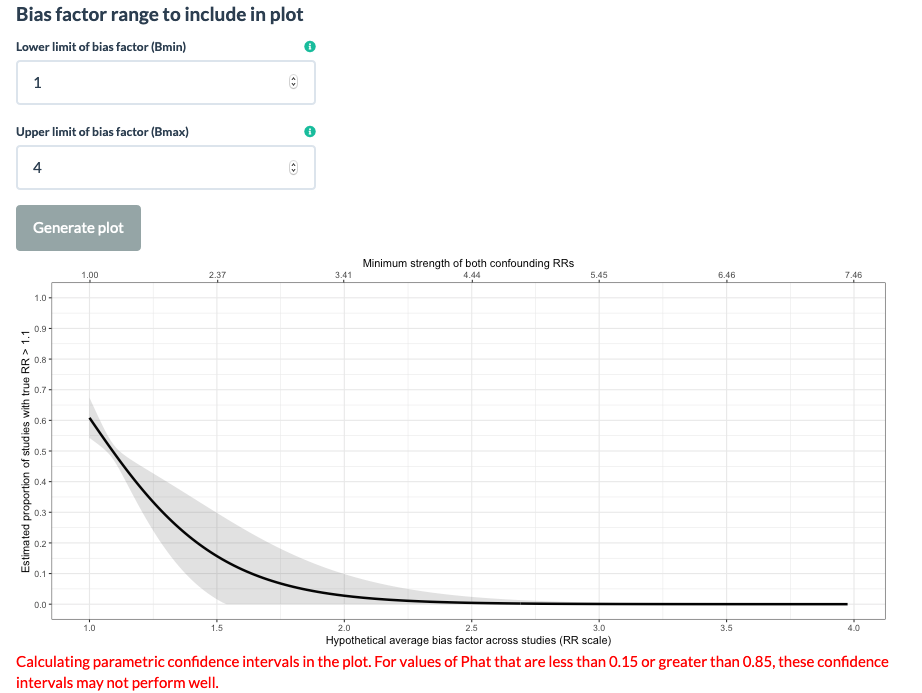
```

#### test9 data_calib_test_1-1.csv file
```{r error=TRUE}
d = read.csv("Datasets for website test/data_calib_test_1-1.csv")

## parametric method test
## vt2 = prop*t2^2
## see what errors if all 0
confounded_meta(method="parametric",
                q=log(0),
                r=0,
                tail="above",
                muB=log(0),
                sigB=0,
                yr=log(0),
                vyr=0^2,
                t2=0,
                vt2=0*(0^2))
### R output:
# Error in confounded_meta(method = "parametric", q = log(0), r = 0, tail = "above",  : 
#   Must have t2 > sigB^2

### Website output: 
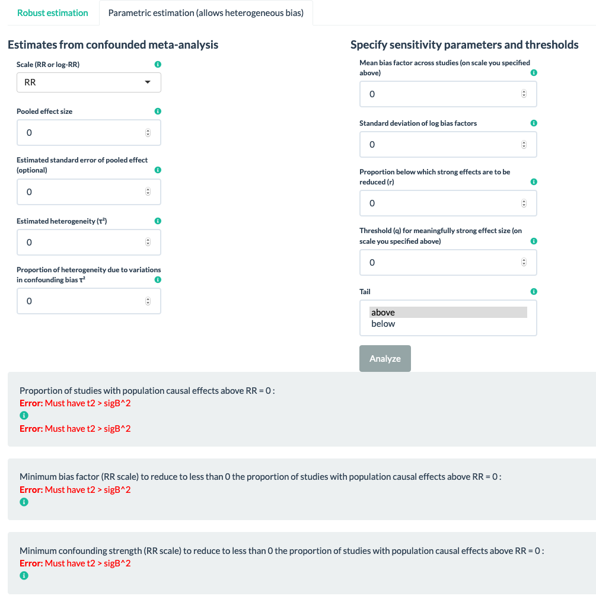
```


#### test10 kodama_prepped.csv
```{r error=TRUE}
d = read.csv("Datasets for website test/kodama_prepped.csv")

## parametric method test
## vt2 = prop*t2^2
confounded_meta(method="parametric",
                q=log(.5),
                r=0.75,
                tail="below",
                muB=log(1.5),
                sigB=.25,
                yr=log(1.5),
                vyr=0.1^2,
                t2=0.25,
                vt2=0.5*(0.25^2))
### R output:
#   Value        Est        SE CI.lo     CI.hi
# 1  Prop 0.05471561 0.0874276     0 0.2260706
# 2  Tmin 0.23791135 0.3332082     1 0.8909875
# 3  Gmin        NaN       NaN   NaN       NaN
# Warning messages:
# 1: In confounded_meta(method = "parametric", q = log(0.5), r = 0.75,  :
#   Phat is close to 0 or 1. We recommend choosing method = "calibrated" or alternatively using bias-corrected and accelerated bootstrapping to estimate all inference in this case.
# 2: In sqrt(Tmin^2 - Tmin) : NaNs produced

### Website output: 
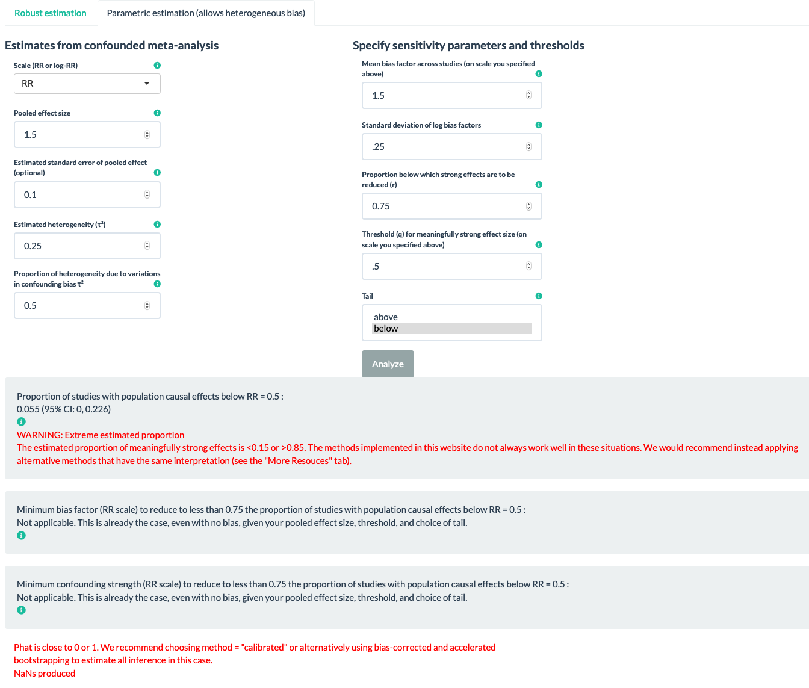


sens_plot(method = "parametric",
          type="line",
          q=log(.5),
          yr=log(1.5),
          vyr=0.1^2,
          t2=0.25,
          vt2=0.5*(0.25^2),
          Bmin=log(1),
          Bmax=log(4),
          sigB=0,
          tail="below" )

### R output:
# Warning message:
# In sens_plot(method = "parametric", type = "line", q = log(0.5),  :
#   Calculating parametric confidence intervals in the plot. For values of Phat that are less than 0.15 or greater than 0.85, these confidence intervals may not perform well.

### Website output: 
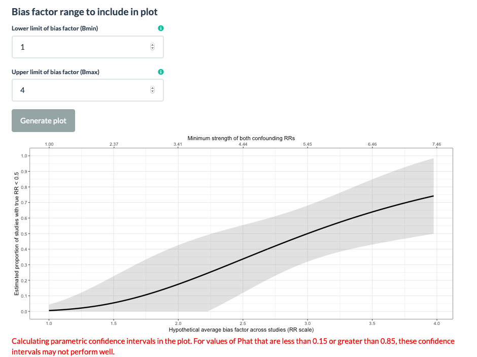
```


#### test11 kodama_prepped.csv
```{r error=TRUE}
d = read.csv("Datasets for website test/kodama_prepped.csv")

## on log-RR scale
# log(1.2)
## parametric method test
## vt2 = prop*t2^2
confounded_meta(method="parametric",
                q=0.1823216,
                r=0.2,
                tail="below",
                muB=.2,
                sigB=.25,
                yr=.4,
                vyr=0.1^2,
                t2=0.25,
                vt2=0.1*(0.25^2))
### R output:
#   Value       Est         SE     CI.lo     CI.hi
# 1  Prop 0.4837171 0.09211893 0.3031673 0.6642669
# 2  Tmin 1.2252345 0.22744734 1.0000000 1.6710231
# 3  Gmin 1.7505582 0.54144924 1.0000000 2.8117792

### Website output: 
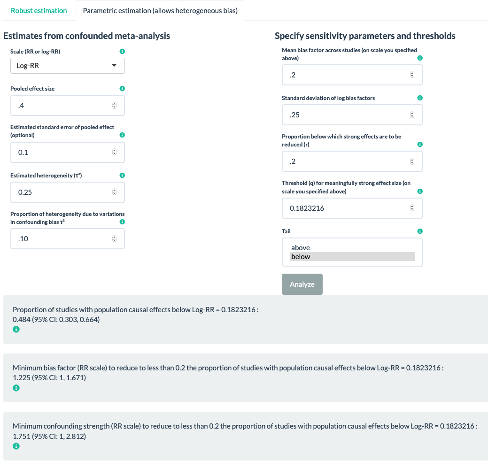


sens_plot(method = "parametric",
          type="line",
          q=0.1823216,
          yr=.4,
          vyr=0.1^2,
          t2=0.25,
          vt2=0.1*(0.25^2),
          Bmin=1,
          Bmax=6,
          sigB=.25,
          tail="below" )

### R output:
# Warning message:
# In sens_plot(method = "parametric", type = "line", q = 0.1823216,  :
#   Calculating parametric confidence intervals in the plot. For values of Phat that are less than 0.15 or greater than 0.85, these confidence intervals may not perform well.

### Website output: 
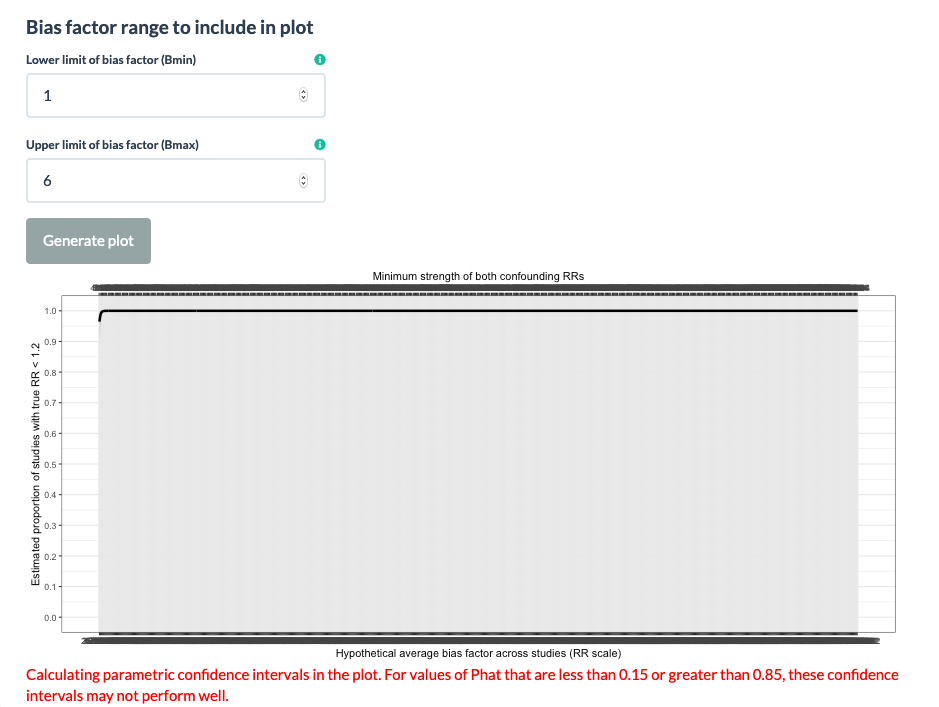
```

Add a new chunk by clicking the *Insert Chunk* button on the toolbar or by pressing *Cmd+Option+I*.

When you save the notebook, an HTML file containing the code and output will be saved alongside it (click the *Preview* button or press *Cmd+Shift+K* to preview the HTML file). 

The preview shows you a rendered HTML copy of the contents of the editor. Consequently, unlike *Knit*, *Preview* does not run any R code chunks. Instead, the output of the chunk when it was last run in the editor is displayed.

